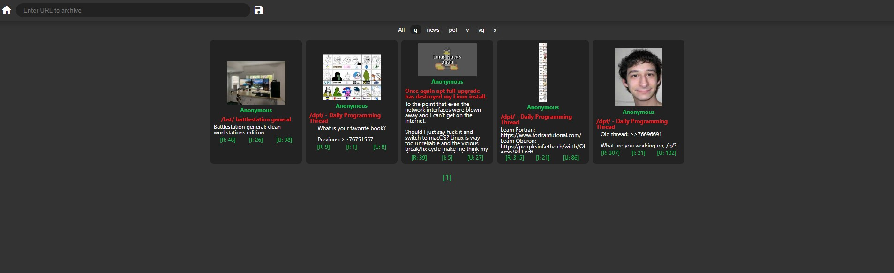
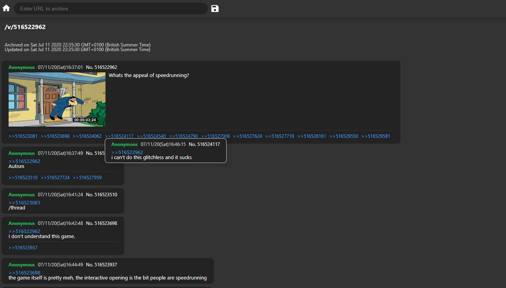

# :four_leaf_clover: Archivist

Thread archival tool and CMS.

- [Prerequisites](#prerequisites)
- [Quick Start](#quick-start)
- [Features](#features)
- [API](#api)
- [Environment Variables](#environment)

<a name="prerequisites"></a>

## Prerequisites

1. [NodeJS](https://nodejs.org/en/) - JavaScript runtime
2. [MongoDB](https://www.mongodb.com/) - Database

<a name="quick-start"></a>

## Quick Start

Clone the repository

```bash
git clone https://github.com/brookesb91/archivist.git
```

Navigate to the project directory

```bash
cd archivist
```

Install dependencies

```bash
npm i
```

Start the server

```bash
npm run start
```

Open a browser and navigate to the app. By default, the server is available at `localhost:3000`

<a name="features"></a>

## Features

### Done

- [x] Reply hover preview
- [x] Quote hover preview
- [x] Quote anchors
- [x] Colourised poster IDs\*
- [x] Country flags\*
- [x] Code formatting\*

### To Do

- [ ] Full archival of thread images
- [ ] Math formatting\*
- [ ] Flash embed\*
- [ ] Reverse image search
- [ ] Thread & post deletion

> \*For boards that support this feature

<a name="api"></a>

## API

> All paths are relative to the configured base URL.

| Method | Path                      | Description                         |
| ------ | ------------------------- | ----------------------------------- |
| `GET`  | `/`                       | Archive catalog view                |
| `GET`  | `/archive/:board/:thread` | Thread view                         |
| `POST` | `/save`                   | Archive a thread from the given URL |

<a name="environment"></a>

## Environment Variables

> Create a .env file in the project root to override values.

| Name        | Description            | Default                         |
| ----------- | ---------------------- | ------------------------------- |
| NODE_ENV    | Node environment       | `development`                   |
| PORT        | Server port            | `3000`                          |
| HOST        | Server host            | `localhost`                     |
| MONGODB_URI | MongoDb connection URI | `mongodb://localhost/archivist` |

## Screenshots




